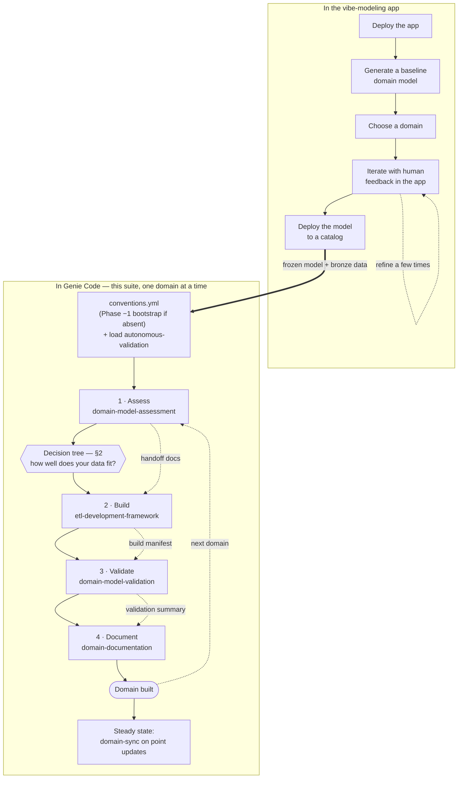
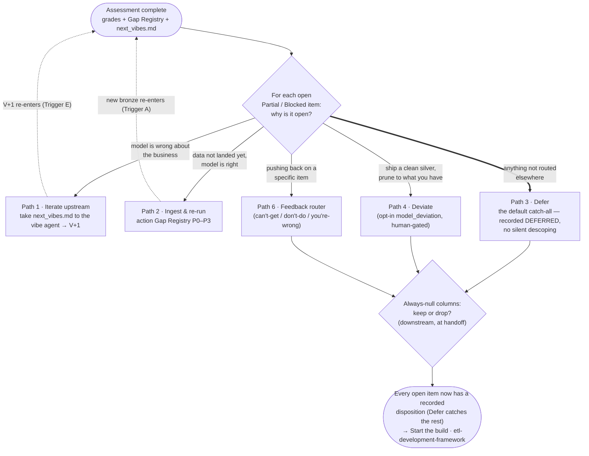

# Workflow map — where to start, and what to decide

Two pictures for orienting a run of the suite: **when to start using the skills** (and where you
enter the loop), and **the decision tree after the assessment completes**. Both are maps, not the
spec — each links to the prose that is the source of truth. GitHub renders the diagrams inline.

---

## 1 · When to start using the skills

Getting started spans **two phases with a clean handoff between them**. First, upstream in the
**vibe-modeling app**: deploy the app, generate a baseline domain model, pick the domain you want
to bring alive, iterate on it a few times with human feedback *in the app*, then deploy the settled
model to a **catalog**. That deployed model — coherent and human-reviewed — is the **frozen input**
to this suite.

Then, in **Genie Code**, this suite picks up: settle `conventions.yml` (the assessment bootstraps
it interactively in Phase −1 if it's absent), load `autonomous-validation` alongside the loop
skills, and run the `domain-model-assessment` to see **how well your real data fits the modeled
domain**. Its output — grades + Gap Registry + `next_vibes.md` — is exactly what the
[decision tree in §2](#2--the-decision-tree-after-the-assessment) acts on. Clear that gate and the
four stations run **one domain at a time**; once a domain is built, `domain-sync` keeps its
artifacts current in steady state.

**Handoff between stations is through documents, not chat** — the dotted links are the artifacts
(`etl_detailed_spec.md` → `build_manifest.md` → `validation_summary.md`) that carry discovery
forward so it runs once. New to the loop? Run it end-to-end on the Meridian domain via the
[tutorial](tutorial.md); the station catalog and handoff chain are in [reference.md](reference.md).

---

## 2 · The decision tree after the assessment

The `domain-model-assessment` ends with an S2T Mapping Report, a Gap & Enhancement Registry, and
`next_vibes.md` — plus a Full / Partial / Blocked grade per entity. Before the build, you close the
gap between the vibe model and your real data by giving **every open (Partial/Blocked) item a
recorded disposition**. The paths below are not mutually exclusive — defer some entities, take a
few vibes upstream, deviate on others, all in the same handoff. The build starts from that durable
record, never from the conversation.

Each path — when to pick it, how to invoke it, and its trade-off — is written out in
[how-to/decide-before-the-build.md](how-to/decide-before-the-build.md). The two feedback loops it
draws on (the Gap Registry for data-catches-up, `next_vibes.md` for model-refinement) and the
bright line between them are explained in [explanation.md](explanation.md#how-it-fits-with-the-vibe-model).
